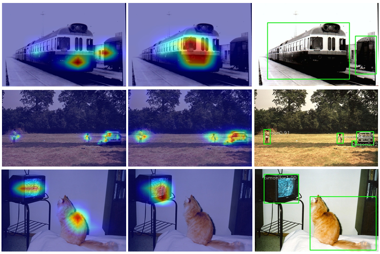

# ASSD-Pytorch
<p align="center">
	
</p>

Please cite the article in your publications if it helps your research ([arxiv link](https://128.84.21.199/pdf/1909.12456.pdf)):

	@article{YI2019102827,
        title = "ASSD: Attentive single shot multibox detector",
        journal = "Computer Vision and Image Understanding",
        pages = "102827",
        year = "2019",
        issn = "1077-3142",
        doi = "https://doi.org/10.1016/j.cviu.2019.102827",
        url = "http://www.sciencedirect.com/science/article/pii/S1077314219301328",
        author = "Jingru Yi and Pengxiang Wu and Dimitris N. Metaxas",
    }

ASSD learns to highlight useful regions on the feature maps while suppressing the irrelevant information, thereby providing reliable guidance for object detection.


| System | VOC2007 test |VOC2012 test | **FPS** (TitanX) | #Boxes | Input resolution
|:-------|:-----:|:-----:|:-------:|:-------:|:-------:|
| SSD300 (VGG16) | 77.2 | 75.8 | 46 | 8732 | 300 x 300 |
| SSD512 (VGG16) | 79.8 | 78.5 | 19 | 24564 | 512 x 512 |
| ASSD300 (VGG16) | 80.0 | 77.5 | - | 8732 | 300 x 300 |
| ASSD321 (ResNet101) | 79.5 | 76.4 | 27.5 | 10325 | 321 x 321 |
| ASSD512 (VGG16) | 81.6 | 80.0| -  | 24564 | 512 x 512 |
| ASSD513 (ResNet101) | **83.0** | **81.3** | 16 | 25844 | 513 x 513 |


<p align="center">
	
</p>

## Dependencies
Library: OpenCV-Python, PyTorch>0.4.0, Ubuntu 14.04

## Dataset
### PascalVOC
  ```Shell
  # Download the data.
  cd $HOME/data
  wget http://host.robots.ox.ac.uk/pascal/VOC/voc2012/VOCtrainval_11-May-2012.tar
  wget http://host.robots.ox.ac.uk/pascal/VOC/voc2007/VOCtrainval_06-Nov-2007.tar
  wget http://host.robots.ox.ac.uk/pascal/VOC/voc2007/VOCtest_06-Nov-2007.tar
  # Extract the data.
  tar -xvf VOCtrainval_11-May-2012.tar
  tar -xvf VOCtrainval_06-Nov-2007.tar
  tar -xvf VOCtest_06-Nov-2007.tar
  ```
### MSCOCO 2017 ([download link](http://cocodataset.org/#download))
  ```Shell
	#step1: download the following data and annotation
	2017 Train images [118K/18GB]
	2017 Val images [5K/1GB]
	2017 Test images [41K/6GB]
	2017 Train/Val annotations [241MB]
	#step2: arrange the data to the following structure
	COCO
 	---train
	---test
	---val
	---annotations
  ```


## Train/Test/Evaluation
```Shell
This is a simplified version. The full version will be released later.
1. Change the mode in main.py
2. Change parameters such as root(data directory) in config.py
3. python main.py
```
